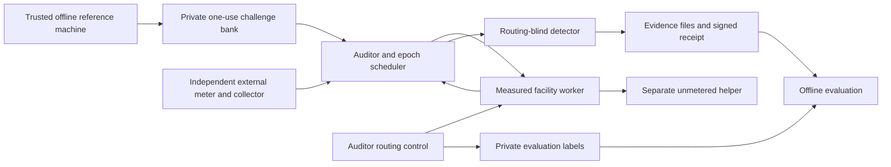

# Compute Echo architecture, revision 3

Updated September 6, 2026. This document supersedes the implementation choices in
the supplied revision-2 architecture. The user-approved compact-result protocol,
four workload modes, dependent memory design, and explicit experimental epochs
are implemented here. The original project motivation and claim limitations remain.

## 1. Scope and acceptance

Demonstrate that local and outsourced fresh computation both pass the same
computational target, while independently observed local power differs reliably.
The backend supplies evidence of consistency under a tested model. It cannot bind
returned mathematics and electricity to the same silicon cryptographically.

The immediate setup is one measured worker and one unmetered helper. Per-GPU/rack
codes, attribution, hardware-secret signaling, device attestation/vendor integration,
and the polished dashboard are postponed. GPU execution through CUDA/cuBLAS is
implemented; it does not imply NVIDIA attestation integration.

The minimum physical acceptance experiment is TENSOR versus IDLE. MEMORY and MIXED
are executable and use the same scheduling interfaces now, but receive no special
physical status until calibrated evidence supports it. No GPU-class fingerprint is
claimed: distinguishing workload modes on one known GPU cannot establish a
hardware-class classifier across multiple GPU classes.

## 2. Components and trust boundaries

The auditor, reference generator, bank keys, and meter/collector installation are
trusted. Facility host and helper can supply malicious output or diagnostic times.
The meter credential is distinct from worker/control/admin credentials. The meter
branch excludes the auditor, helper, monitor, and other unaccounted equipment.
Independent hosting alone is insufficient if source readings come from the hostile
worker. Installation and clock-alignment assurance remain explicit commissioning
assumptions.

## 3. Trusted compact-result protocol

Offline generation uses cryptographically random 32-byte seeds and deterministic
workloads. The bank stores seed, full specification, expected SHA-256 aggregate,
reference backend, and reference pipeline times. Payloads are Fernet encrypted;
the key and database remain in a private local directory. Encryption is an
additional barrier; placing its key beside the database does not protect against
an attacker who can read the entire private directory.

SQLite WAL with synchronous FULL and BEGIN IMMEDIATE implements atomic issuance.
The issued timestamp and PENDING outcome commit before the seed is returned to the
transport. Crashes, transmission failures, timeout, stop, invalid answers, and bank
reopening never make it available again. Database triggers prevent deletion or
clearing an issued timestamp. A separate durable worker ledger rejects reused
challenge IDs and seed hashes.

There is no bank generation/lookup endpoint on the worker or auditor API. A single
auditor holds an OS process lock. Startup marks unfinished issued challenges
INTERRUPTED without returning them to the pool. Do not restore an old database as
an active issuance bank or copy a live bank to multiple independent auditors:
ordinary filesystem rollback protection is outside this prototype. Archive an old
bank and generate new challenges after losing issuance state.

The auditor does substantial reference work offline; digest comparison makes live
checking cheap. Reference work may be computed sequentially well before the audit.
There is no claim of a universal minimum work proof or an asymptotically cheap
reference generator. Exact wire semantics are in PROTOCOL.md.

## 4. Four workload modes

| Mode | Work and verified output |
| --- | --- |
| IDLE | No active kernel; challenge/spec-bound digest; scheduler preserves the idle window |
| TENSOR | Fresh A/B per batch operation; bounded INT8 inputs; exact INT32 GEMM; every C hashed |
| MEMORY | Fresh mutable uint32 buffers and states; dependent read/write sequence; final buffers and states hashed |
| MIXED | Each operation runs and hashes one tensor multiplication followed by one dependent memory workload |

MIXED is an explicit interleaving, not simultaneous resource saturation. Each mode
has a fixed, documented operation count. A segment is a fixed-duration measurement
window; computation can finish before it ends. IDLE is not evidence of enforced
idleness on an untrusted host. No identical multiplication is repeated and counted
as fresh work, and no time-dependent loop changes the expected digest.

Workload shape, input generation, hashing, thermal state, kernel warmup, power caps,
and CPU/GPU transfer can dominate physical behavior. Size operation counts to
produce an observable complete-pipeline response over the chosen window. If the
response does not settle before the measured active work ends, this v1 settled
segment detector must abstain; do not force a calibration by shortening its
exclusion period. A future waveform-convolution detector is a possible enhancement,
not a current capability.

## 5. Timing and numerical measurements

Workers report input generation, host/device transfer, execution, device/host
transfer, output serialization/aggregation, hashing, operational safety checks,
and total worker time. CUDA stages synchronize so timings include completed GPU
work rather than kernel launch time alone. Stage values include host overhead for
the corresponding calls; they are not hardware-only CUDA event measurements.

The auditor measures deadline compliance with a monotonic clock, covering its
issuance overhead, transport, execution, response transmission, and parsing.
HTTP transport additionally records bytes and response-body receive duration.
One-way network transmission cannot be isolated from buffering/unsynchronized
clocks, so that field is null instead of invented. Host timing diagnostics never
replace the auditor's deadline measurement.

Accepted work is reported as on-time valid tasks, nominal integer operations,
prescribed dependent-memory updates, and nominal integer operations per complete
audit second. This includes idle periods. It is not a measured TFLOPS count or a
lower bound on required memory traffic, and is never converted to GPU inventory.

## 6. Epoch lifecycle

`READY -> WASHOUT -> COLLECTING -> COMPLETE | INTERRUPTED`

The controller closes and awaits the current epoch, explicitly cancels/drains any
in-flight worker and helper, changes routing, then starts a new epoch. Washout uses
the measured calibration value. Before a profile exists, provisional physics runs
must explicitly declare an unmeasured washout duration. A failed quiescence blocks
new computation; cancelling an HTTP await alone is not treated as stopping a GPU.

The scheduler randomly shuffles active modes and pairs each with IDLE in random
order. The sequence is balanced 50% active and 50% idle, with at most two consecutive
active segments. Only the current challenge's seed is issued. Workload types share
the segment duration and deadline, and equivalent route experiments reuse the full
specification/counts, never the seed. Progress reports completed/total segments.

No verdict is issued from mixed old/new windows. An interrupted epoch is preserved
separately. Every subsequent epoch has its own ID, fresh issued challenges, and
bounded measurement interval. Routing ground truth exists in the control plane
and private evaluation label file only; EpochEvidence rejects a route field.

## 7. Meter ingestion and the physics spike

The adapter contract accepts meter identity, monotonic collector sequence, acquisition
UTC nanoseconds, watts, quality, and a genuine hardware update sequence or timestamp.
Samples are authenticated, finite, range checked, time checked, and durably rejected
on replay/out-of-order data. Device sequence reset requires re-commissioning a new
identity; it cannot silently reset a replay counter. Readings above the configured
power limit are preserved and cause an operational stop.

Polling frequency does not become meter sample cadence. Hardware timestamps permit
reporting the interval between observed device samples. Together with a genuine
update counter they permit estimating the native period, accounting for skipped
polls by dividing device elapsed time by update-count increments. With only fresh
hardware update counters, the report gives the collector-observed fresh-update
cadence and leaves exact native cadence unknown. Without either, readings are
diagnostics and physical verdicts are INSUFFICIENT.

Phase 0 extracts repeated IDLE-to-TENSOR and TENSOR-to-IDLE transitions. It reports observed 10% lag,
10-to-90% transition time, signed step amplitudes, observed update cadence, missing data, and a
conservative washout after the slowest observed 90% crossing plus two observations.
At least three usable rising and three falling transitions are required. This measures combined workload
startup and sensor behavior; it is not an isolated laboratory transfer function of
the meter. CPU/GPU pipelines and local/forwarded timings are saved separately.

The independent device-specific adapter and actual measurements remain pending
until equipment and endpoints are supplied. Simulation/host telemetry provenance
is never promoted to an external physical pass.

## 8. Calibration, qualification, and independent evaluation

Four disjoint sets are used: step characterization, >=3 trusted local training
epochs, >=3 held-out local qualification epochs, and final local/forwarded evaluation
epochs. Calibration cannot rely on an uninspected claimed fleet. Hardware/software
configuration is recorded and must remain equivalent.

Within each settled segment the detector uses one power mean, rejecting sparse
coverage, gaps, invalid bounds, foreign meters, duplicate samples, unknown work
specifications, and unsupported operating conditions. Per-run regression separates
baseline and linear drift from active mode amplitudes. No sample-level confidence
interval treats smoothed samples as independent. Reported ranges are empirical.

Training fits both candidate representations:

- fine categories IDLE/TENSOR/MEMORY/MIXED;
- IDLE versus one shared ACTIVE category.

Fine categories require separated training run amplitudes and successful held-out
mode discrimination. Complete frozen candidate models, including gain/correlation
and noise thresholds, are also checked on validation runs. Validation selects an
already fitted supported representation and never retunes thresholds. If fine
categories fail, ACTIVE is tried; if ACTIVE also fails, calibration remains invalid.
Adding an uncalibrated mode or changing a workload spec cannot reuse a valid model.
Timing differences are reported separately with run-median training/held-out ranges.

Inference removes an intercept and linear drift from expected and measured segment
means. Shape correlation and fitted response gain remain separate. Low gain with
low residual noise can be inconsistent even if correlation is undefined because the
measured response is flat. Excess residual or within-segment noise yields
INSUFFICIENT. Gain is not a local GPU percentage.

Final evaluation joins routing labels afterward and reports all counts with
denominators, false alarms, missed/inconclusive outcomes, and route-specific pipeline
times. The conservative demo gate requires three complete computationally passing
epochs per route with equivalent specification multisets, all local responses
consistent and all forwarded responses inconsistent. This is a demo acceptance
criterion, not a population detection-rate guarantee.

## 9. Independent findings and receipts

Per-challenge outcomes: PENDING, PASS, DEADLINE_FAILED, INCORRECT, INTERRUPTED, ERROR.
Digest match and deadline compliance are also stored independently: a correct late
answer is distinguishable from an incorrect answer or no answer.

Aggregate fields preserve computational correctness, performance, physical response,
and the original outcomes. Known invalid mathematics remains INVALID_COMPUTATION
even when physical evidence is missing. A known deadline failure remains below
target. Otherwise insufficient/incomplete physical evidence yields INCONCLUSIVE.
No finding automatically accuses an operator of fraud.

Signed receipts cover the final finding, method, calibration ID, site/installation
assumptions, meter provenance, interval, public-key ID, and hashes of raw evidence
files. Verification requires a separately trusted issuer key ID. A public key
embedded in an arbitrary receipt does not authenticate a trusted auditor by itself.
Receipts set hardware_enforcement=false and software_registered device identity.

## 10. Operational boundaries

Use one auditor process per private bank and one executing task per worker. Worker
and helper can run independently on different machines with separately provisioned
credentials. APIs bind to loopback by default. Outside a controlled lab network use
TLS termination or an authenticated tunnel to protect private challenge delivery and
credentials. Worker processes must not have access to the auditor's private files.

The available CUDA worker checks local temperature periodically (default stop at
85 C), stops on missing temperature diagnostics, and checks cancellation between
GEMMs and bounded memory chunks. These diagnostics are safety controls, not trusted
audit evidence. A kernel already executing is not hard-preempted. Facility power
limits and sensor loss are independently monitored by the auditor.

Raw JSONL events, samples, final evidence, findings, and receipts are retained.
Issued seeds may appear in events; unused seeds and expected digests never do.
Future work and real-world acceptance gates are tracked in STATUS.md.

### 10.1 RunPod host telemetry plane

The RunPod proof-of-concept adds a separate `NVML_DEMO` observability plane. Each
Pod reports its own GPU identity, board/module power, and utilization. These host
diagnostics never enter `MeterStore`, `EpochEvidence.samples`, calibration, or the
production detector. Helper observations are evaluation-only attack ground truth.
